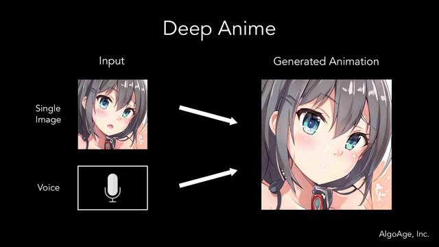

# Machine Learning 🤖💻

Hola espero que estén bien sean bienvenidos al curso de Machine Learning. Un agradecimiento enorme por parte de los colaboradores y con todo el deseo que este curso sea grato para su vida profesional. ✍🏻

## 📄 Requisitos.
Estos requisitos son fundamentales para que se obtenga una mejor comprensión del tema.

* Conocimientos básicos - intermedios de Python y Teminal (CMD)
* Conocimientos básicos - intermeidos de cálculo, álgebra lineal, estadística y probabilidad.

## ✒️ Temario.

### Machine Learning I. Semana I.

- Introducción a Python.
    - ¿Qué es el aprendizaje máquina (Machine Learning)?
    - Herramientas de desarrollo.
- Matemáticas Esenciales.
    - Variables dependientes e independientes.
    - Funciones en $\mathbb{R}$ (Una variable).
    - Funciones en $\mathbb{R}^{n}$ (Más de una variable).
    - Derivadas de una variable.
    - Derivadas de varias variables.
    - Descenso de gradiente.
- Python y Jupyter Notebook.
    - Numpy.
    - Matplotlib.
    - Scipy.
    - Scikit-learn.
    - Pandas.
- Aprendizaje por refuerzo.
    - Ecuadre típico.
    - Ecuación de Bellman.
    - Proceso de Markóv.
- Análisis previo a los datos.
    - Detección de valores nulos y atípicos.
    - Matriz de correlaciones (Pearson).
-  Aprendizaje no supervisado.
    - Métricas de similitud.
    - Clústering Jerárquico.
    - Clústering Particional.

### Machine Learning II. Semana 2.

- Ingeniería de Datos.
    - Bases de datos relacionales.
    - Estructuras CSV, JSON, XML.
    - Herramientas de Nube (SageMaker, Azure Lab, Rekognition).
- Aprendizaje supervisado.
    - Regresión Lineal Simple.
    - Regresión Lineal Múltiple.
    - Regresión Lógistica.
    - Árboles de Regresión y Clasificación.
    - Bosques Aleatorios.
-  Introducción a Deep Learning.
    - Concepto de redes neuronales y tensores.
    - Concepto de Perceptrón (Neurona).
    - Función de activación.
    - Función de optimización.
    - Ejemplo básico con TensorFlow.

### Más información.
- [Curso de Python](https://github.com/SamArtGS/Curso-Python)
- [TensorFlow](https://www.tensorflow.org/?hl=es-419)
- [Scikit-learn](https://scikit-learn.org/stable/)

### Contacto.
**Juan Angeles Hernández:** juanah.proteco@gmail.com

**Samuel Arturo Garrido Sánchez:** samuelgarrido.proteco@gmail.com
